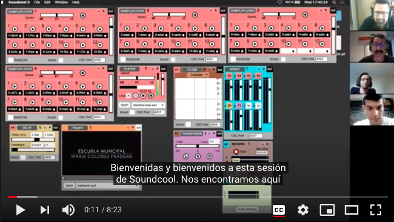

# SONOTRONICA

El índice de este documento está relacionado con las clases de SONOTRÓNICA,
sirva este documento como diario de la experiencia impartiendo esta asignatura.

# PRIMER CURSO

## Primer Trimestre

### [OCTUBRE](primer-curso/octubre.md) - Halloween

### [NOVIEMBRE/DICIEMBRE](primer-curso/noviembre.md) - Typing Music Club

## Segundo Trimestre

### [ENERO](primer-curso/enero.md) - Programando 01010101
### [FEBRERO](primer-curso/febrero.md) - Die Roboter

### [MARZO](primer-curso/marzo.md) - Los sonidos de casa

## Tercer Trimestre

### [ABRIL](primer-curso/abril.md) - Un cuento sonoro
### [MAYO](primer-curso/mayo.md) - Historia de los Beats
### [JUNIO](primer-curso/junio.md) - Remix

# SEGUNDO CURSO
