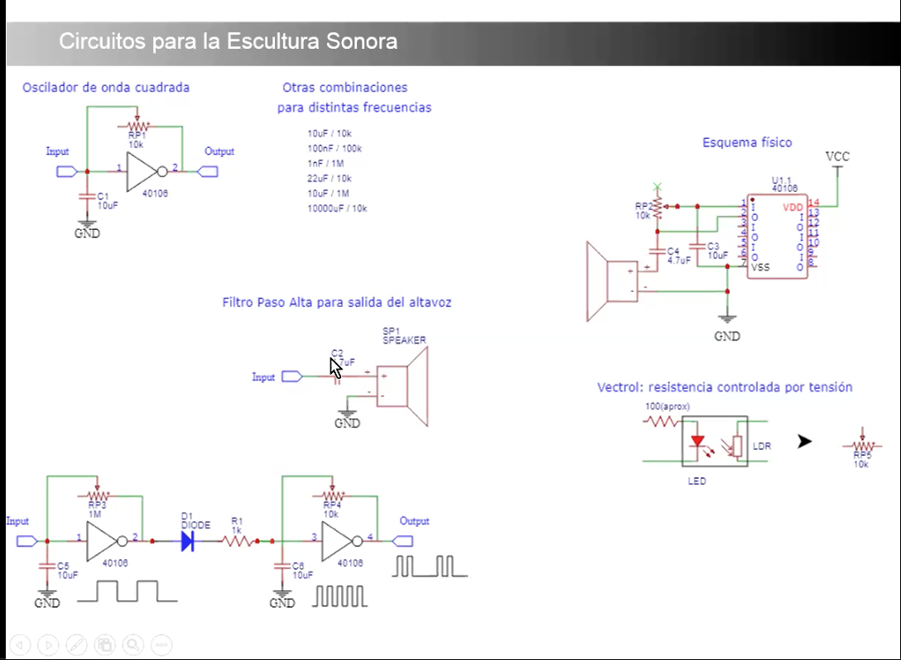
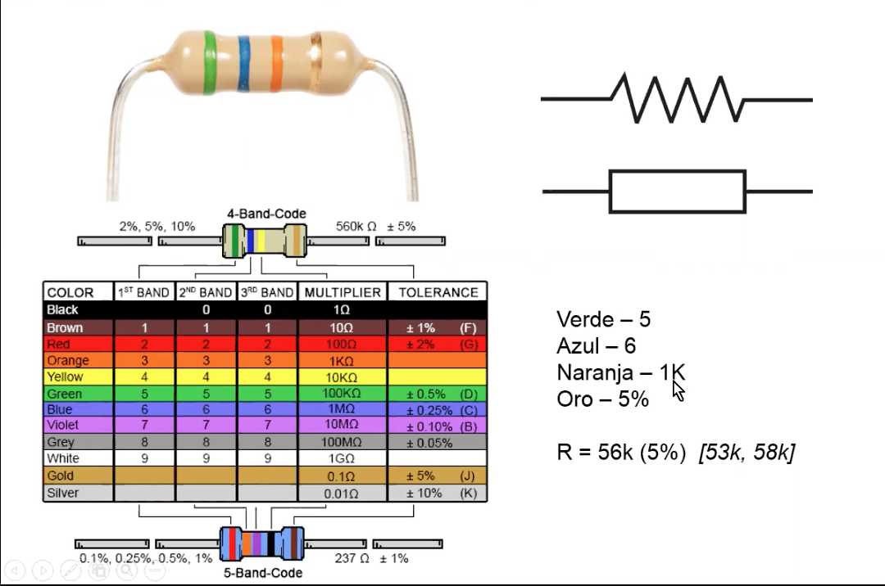
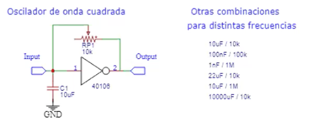
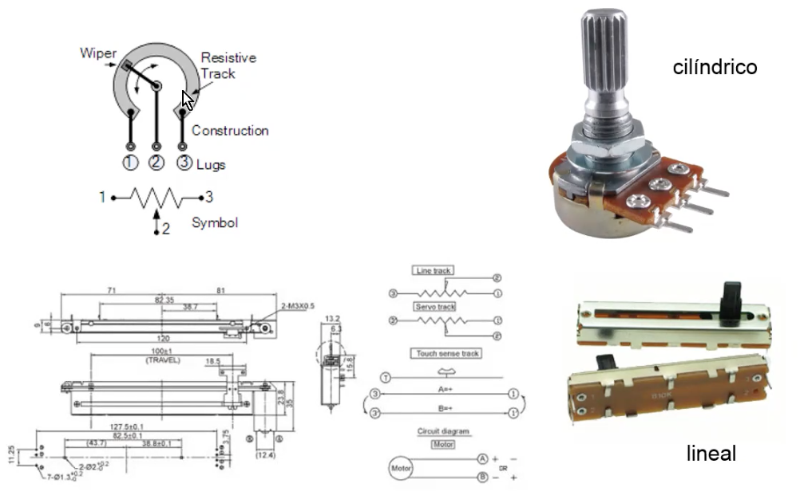
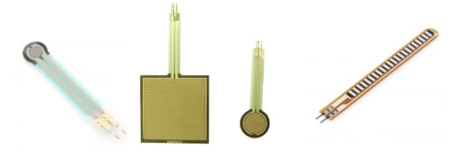
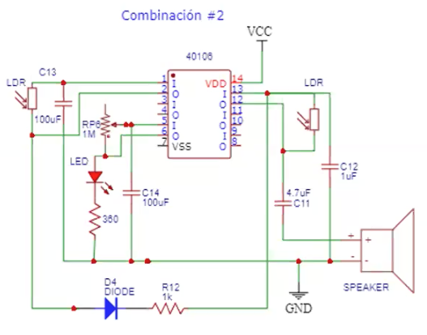
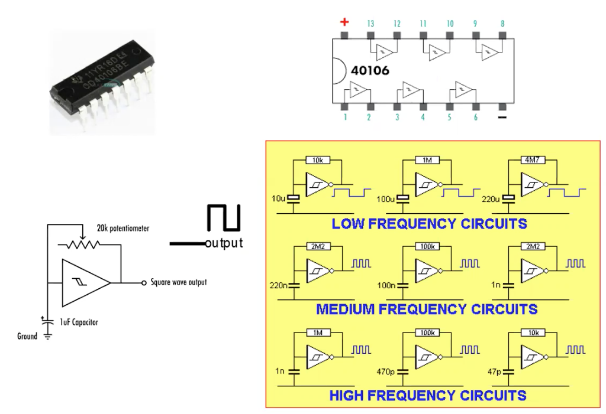
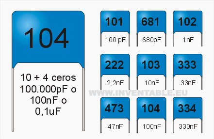

# Primer trimestre

## Primera Semana

## Segunda Semana

Valores de los capacitadores de las bolsas:

470 -> 47pF
221 -> 220pF
681 -> 680pF
331 -> 330pF
220 -> 22pF
680 -> 68pF
101 -> 100pF
421 -> 420pF
330 -> 33pF
220 -> 20pF
