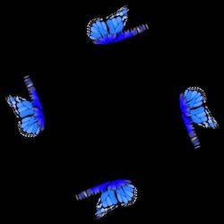
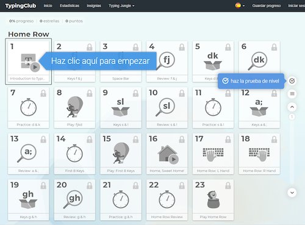
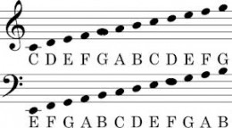
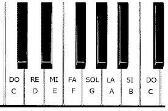
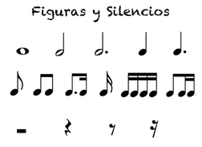

## [~ Índice ~](Indice.md)

# NOVIEMBRE
En este proyecto vamos a crear unas esculturas holográficas usando las pantallas de nuestros ordenadores. 
Los hologramas van a ser del tipo pirámide. Que necesitan un video colocado en forma de X, cuatro veces, tal y como aparece en este foto:

Para ello vamos a aprender a animar en scratch, y a colocar la animaciones de forma que se vean bien en el holograma y aparte vamos a aprender a reescribir villancicos usando código, también en scratch.

# PRIMERA SEMANA

Para mejorar nuestras habilidades al teclado, y poder programar con rapidez y seguridad, necesitamos aprender a mecanografiar bien. Para ello, vamos a emplear 10 minutos en el proyecto [typingclub](https://www.typingclub.com/).
En esta web, de forma gratuíta, a través de juegos, puedes ir descubriendo las teclas y aprender a encontrarlas sin mirar el teclado. Cosa muy importante y necesaria en programación informática.

Luego, vamos a scratch y vemos cómo tenemos que hacer para comenzar a hacer melodías. Lo primero es aprender que en inlgés las notas no se llaman de la misma forma que en español, sino que se usan letras: 
Do -> C, Re -> D, Mi -> E, Fa -> F, Sol -> G, La -> A, Si -> B

Además, tenemos que aprender dónde están las notas en el piano:

Y por último tenemos que asignar a cada longitud de la nota, su duración correspondiente. Para ello tomaremos la negra como de duración un segundo y a partir de ahí las demás:
Blanca -> 2 seg, Negra -> 1 segundo, Negra con puntillo -> 1.5 seg, Corchea -> 0.5 segundos, semicorchea -> 0.25 seg

# SEGUNDA SEMANA

En esta segunda semana, vamos a repasar y afianzar lo aprendido la semana pasada sobre las notas, pasando a traducir los villancicos en notas musicales dentro de scratch. Para ello, volvemos a pensar en las notas, las duraciones, repasamos todo lo que se necesita para poder hacer la tarea y nos centramos en la traducción de los villancicos de partituras de notación tradicional a notas en scratch.

Estos son algunos de los resultados.

<iframe src="https://scratch.mit.edu/projects/194661967/embed" allowtransparency="true" width="485" height="402" frameborder="0" scrolling="no" allowfullscreen></iframe>

<iframe src="https://scratch.mit.edu/projects/275308608/embed" allowtransparency="true" width="485" height="402" frameborder="0" scrolling="no" allowfullscreen></iframe>

Para darle un poco más de interés a nuestro proyecto, le añadimos sonidos grabados usando la propia herramienta de grabación de Scratch. Ojo, porque hay que darle permisos al micrófono y no todos los equipos aceptaron esto. 
Los sonidos que se grabaron fueron campanas, panderetas, tambores, y sonidos de cascabeles y metalófonos.

# TERCERA SEMANA

La tercara semana de clase se dedica a hacer la animación. Para ello, partimos de imagenes estáticas para hacer pequeñas modificaciones. Un buen sitio donde descargar imágenes de navidad al estilo cartoon, que sean fácilmente animables es [esta web](http://clipart-library.com/christmas-cartoon-images-free.html).

# CUARTA SEMANA