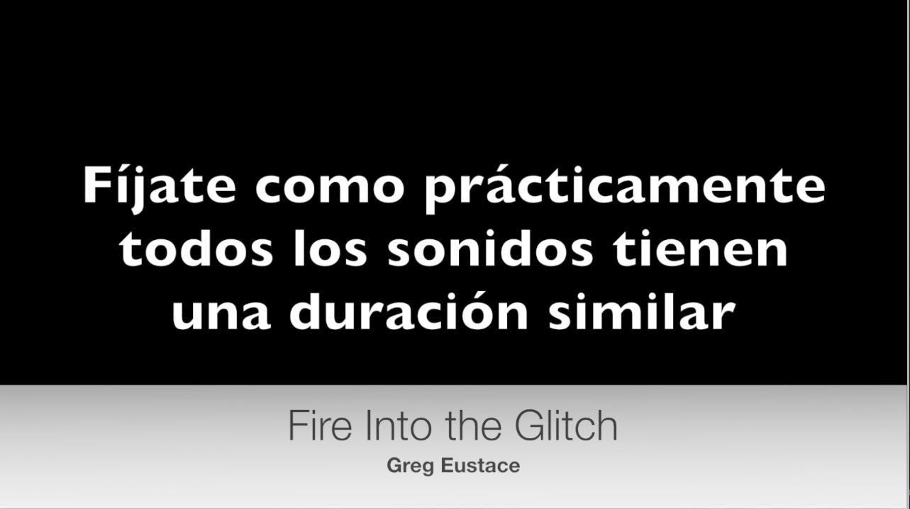
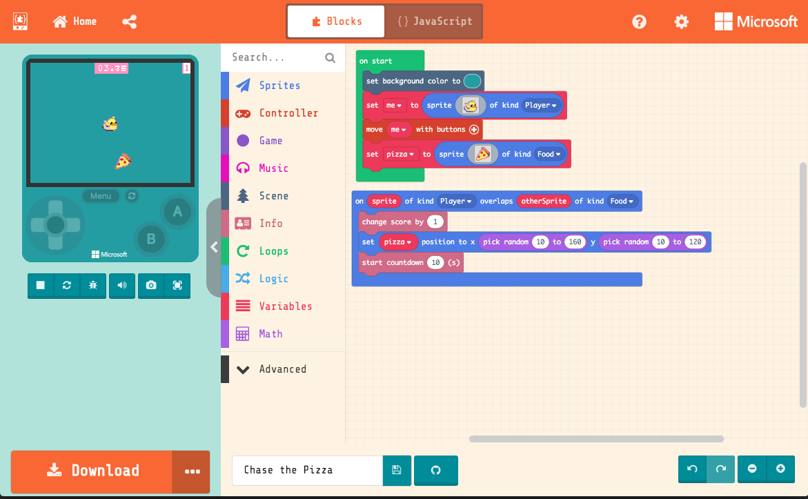

# [INDICE](../indice.md)

# ENERO

En este mes vamos a fundamentar la metodología de lo que será el resto del curso.
SONOTRONICA está fudamentada en una serie de objetivos que a nivel metodológico ordenamos en cuatro grupos de actividades
que se distribuyen a lo largo de las cuatro semanas de un mes. Estos grupos de actividades son:

Pasamos a describir los grupos de actividades en las cuatro semanas del mes de Enero:

- HARDWARE (Aborda lo relativo a cómo funcionan las cosas y los programas)
- PROGRAMACIÓN Y LÓGICA (Aborda del pensamiento lógico matemático y su aplicación creativa)
- ED. AUDITIVA Y TEORÍA DEL SONIDO (Aborda la escucha musical y la teoría sobre el sonido)
- MUSICALIDAD Y PERFORMANCE (Aborda las destrezas performáticas y de manejo de instrumentos musicales electrónicos)

# PRIMERA SEMANA (HARDWARE)

Para este clase de Hardware hemos depositado en cada mesa un cono de altavoz, pilas de 9V y pinzas de cocodrilo.
También necesitaremos cables de minijack.
Los objetivos que nos planteamos son:

- Aprender de la naturaleza eléctrica del sonido.
- Conocer cómo funciona un altavoz
- Aprender para cuales son y para qué sirven las conexiones de un cable de audio.

Se conecta la pila con el altavoz usando las pinzas de cocodrilo y se comprueba el efecto que la corriente eléctrica
tiene en un altavoz.
Se conecta un cable de minijack minijack al ordenador y se reproduce música. Seguidamente se conecta, usando las pinzas
de cocodrilo el altavoz a uno de los canales de minijac y se comprueba cómo se reproduce la música.
Luego se juntan dos alumnos en un grupo y se trata de hacer sonar dos altavoces del mismo minijack para hablar de las diferencias
entre mono y estéreo.

El final de la clase se dedica a conectar varios instrumentos musicales electrónicos a una mesa de mezclas para hacer una improvisación con ellos, aprendiendo tanto cómo se usan y cómo suenan los instrumentos analógicos basados en corriente eléctrica.


# SEGUNDA SEMANA (PROGRAMACIÓN)

Usamos un proyecto denominado *Computer Science Unplugged* para acercar conceptos de programación al alumnado.
En este primer tema se trata de aprender sobre números binarios y su utilización en la informática.

Se realizan varios ejercicos de traducción de números de decimal a binario, por ejemplo:
5 -> 0101
9 -> 1001
Y luego de binario a digital como
0110 -> 6
1010 -> 10
Seguidamente se hace un ejercicio de mensajes secretos, asignando a cada letra un número y encontrando su equivalencia
en binario. Esto nos permite escribir y descifrar mensajes ocultos.

Al final de la clase, creamos un pequeño juego basado en los modems antiguos, que transmitían mensajes en código binario.

Este es el código Sonic Pi usado para crear este módem virtual.

``` python
#################################
#Coded by La Verbena Electrónica#
#         Sonotrónica           #
#################################


# necesitamos un sonido de onda cuadrada y muy corto
use_synth :dpulse
use_synth_defaults release: 0.1

# definición de los valores del beep para 0 y 1
# Buscar en internet las frecuencias reales
zero = hz_to_midi(100)
one = hz_to_midi(1000)

# velocidad de transmisión
bps = 0.08

# mensaje aleatorio, cuatro palabras, cada una con 56 bits (7 bytes)
#4.times do
#  56.times do
#    play [zero, one].choose
#    sleep bps
#  end
#  sleep rrand_i(0.5,1.5)
#end

# Alfabeto traducido a binario
_ = [zero, zero, zero, zero, zero]
a = [zero, zero, zero, zero, one]
b = [zero, zero, zero, one, zero]
c = [zero, zero, zero, one, one]
d = [zero, zero, one, zero, zero]
e = [zero, zero, one, zero, one]
f = [zero, zero, one, one, zero]
g = [zero, zero, one, one, one]
h = [zero, one, zero, zero, zero]
i = [zero, one, zero, zero, one]
j = [zero, one, zero, one, zero]
k = [zero, one, zero, one, one]
l = [zero, one, one, zero, zero]
m = [zero, one, one, zero, one]
n = [zero, one, one, one, zero]
ñ = [zero, one, one, one, one]
o = [one, zero, zero, zero, zero]
p = [one, zero, zero, zero, one]
q = [one, zero, zero, one, zero]
r = [one, zero, zero, one, one]
s = [one, zero, one, zero, zero]
t = [one, zero, one, zero, one]
u = [one, zero, one, one, zero]
v = [one, zero, one, one, one]
w = [one, one, zero, zero, zero]
x = [one, one, zero, zero, one]
y = [one, one, zero, one, zero]
z = [one, one, zero, one, one]

mail2 = [_,_,_,h,o,l,a,_,c,o,m,o,_,e,s,t,a,s,_,_,_,_]
mail = [m,e,_,e,n,t,u,s,i,a,s,m,a,_,e,l,_,c,o,l,e,g,i,o]
long = 21

long.times do |letra|
  5.times do |digito|
    play mail[letra][digito]
    sleep 0.0125
  end
end
```
Se juega a escribir mensajes y escuchar cómo suenan.


# TERCERA SEMANA (EDUCACIÓN AUDITIVA Y TEORÍA DEL SONIDO)

Para este grupo realizamos una audición siguiendo el modelo de EARS2, que se basa en la educación auditiva
basada en composición de sonidos y música electroacústica. Para ello se realiza la visualización de los videos
de su listening room, el primero de ellos se llama *Fire into the Glitch* adjuntamos un pantallazo para
mayor claridad:



Después de la doble escucha de este video, se procede a la creación de partituras gráficas a modo de dictado.

Se reparten hojas pautadas y se explica que pueden dibujar lo que escuchan con total libertad pero tratando de
representar lo mejor posible lo que escuchan, poniendo especial énfasis en los parámetros del sonido que ya conocen:

- Altura (desde la parte más baja del pentagrama a la más aguda)
- Duración (sonidos cortos con puntos, y largos con rayas)
- Variación timbrica (sonidos modulados, inestables con curvas y sonidos constantes con rectas)

La última parte de la clase la dedicamos a presentar los diferentes tipos de sonidos sintéticos con Little Bits:
- Ondas cuadradas, de sierra, sinusoidales y triangulares.
- Envolventes del sonido, que le dan forma al sonido.
- Efectos del sonido: Delays y filtros.

# CUARTA SEMANA (MUSICALIDAD Y PERFORMANCE)

Para el trabjo performático no vamos a pasar directamente a Sonic Pi, puesto que tenemos alumna
que aún tiene 8 años, aparte, queremos que se centren poco a poco en la programación de forma púlblica.

Buscamos un proyecto de ARCADE, y lo programamos primero individualmente, para luego pasar a programarlo
entre todos, en forma de rueda (cada alumno añade una instrucción nueva a la anterior), del mismo modo
como se realizarán más adelante las sesiones from scratch.

Este tema nos sirve también para trabajar el punto segundo de *Computer Science Unplugged* que se trabaja la
representación en binario de imagenes. Esto mismo lo hacen creando los sprites del videojuego que vamos a programar.

Incluimos una foto del programa de Arcade:


