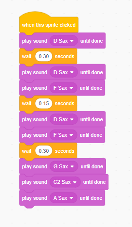
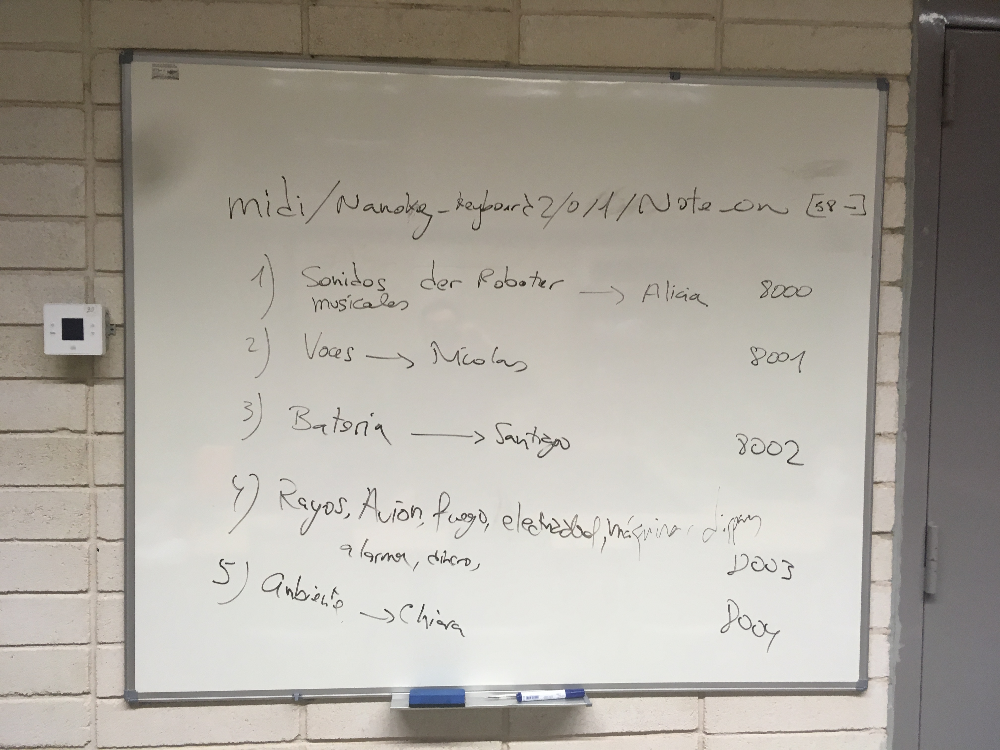

# [INDICE](../indice.md)

# NOVIEMBRE / DICIEMBRE (Proyecto Die Roboter)

En este segundo mes vamos a trabajar en la canción de Kraftwerk Die Roboter.

# PRIMERA SEMANA

En esta primera clase de preparación de la performance, vamos a reforzar la edición de audio con audacity.
Usando un video de youtube (https://www.youtube.com/watch?v=q_h-aOFja4c) que ofrece samples de la pieza The Robots
de Krafwerk vamos a aprender a:

- Aprender a mantener un orden en la producción de audio, con carpetas y subcarpetas: Nombre Alumno, nombre proyecto, audios en bruto y samples finales.
- Aprender a recortar audios, seleccionando aquellas partes que nos interesan más para el directo.
- Aprender a usar el zoom para ver más de cerca o de lejos los sonidos y poder ajustarlos según necesidad.
- Aprender sobre los diferentes formatos de audio: wav, aiff, mp3, etc...
- Aprender a reconocer un buen sonido en loop.

Se descargan los audios de esta pista de youtube y se recortan aquellas partes que necesitamos para luego reproducir la canción completa. Los audios generados se nombran convenientemente y se colocan en una carpeta dentro del Escritorio del ordenador.

Al acabar se intenta montar la canción de nuevo en diferentes pistas de Audacity. Falta tiempo para este trabajo, que por otro lado no es necesario abordar ahora mismo.

# SEGUNDA SEMANA

Retomamos la clase anterior repasando los conceptos explicados relativos al ordenador y los pasos que hay que dar para
poder hacer sonido con él:

- Usuario que tenemos y la contraseña.
- Donde poder acceder al volumen general del ordenador, como conectar los auriculares y la interfaz de sonido.
- Cómo conectarse a un altavoz. La diferencia entre altavoces activos y pasivos.
- Hacer soundcheck poniendo un audio de youtube.

Una vez que queda claro y que todo el mundo ha hecho su soundcheck, repasamos la melodía de Kraftwerk donde lo dejamos la clase
anterior. Cambiamos al gato por un saxofón u otro instrumento musical tradicional en el programa y nos lanzamos a programar de oido
la melodia, sabiendo ya las notas de antemano, que eran: D - D - F - D  |  F - G - C - A. Se insiste en que este trabajo lo hagan solos, para practicar el dictado. Cantan las notas y las intentan programar.

El resultado que nos tiene que dar es este:



Y si queremos hacerlo en Sonic Pi, el resultado es este:

``` python
loop do
  sample :bd_haus
  play :d
  sleep 0.75
  play :d
  sleep 0.25
  sample :bd_haus
  play :f
  sleep 0.25
  play :d
  sleep 0.75
  sample :bd_haus
  play :f
  sleep 0.5
  play :g
  sleep 0.25
  play :c5
  sleep 0.25
  sample :bd_haus
  play :a
  sleep 1
end
```

# TERCERA SEMANA

La segunda semana ya se orienta más hacia la forma final de la performance.
Por comodidad se decide usar Soundcool para alojar todos los sonidos que van a formar parte del proyecto. Se barajan varias posibilidades para la partitura, que son:
- Reproducir fielmente la canción de The Robots.
- Crear una partitura gráfica.
- Sonorizar un video.

Se selecciona ésta última ya que no se ha trabajado mucho la partitura gráfica y por otro lado interesa introducir otros sonidos
en la música más allá de los típicamente musicales. Se selecciona es video Superman meets Kraftwerk (https://www.youtube.com/watch?v=tHKGNpg3dTQ).

En él vamos a diferenciar 5 tipos de sonidos y se asigna cada sonido a un alumno/a. Se puede ver en esta imagen:



Estos grupos de sonidos se agrupan en objetos sampler player y se disparan a través de mensajes OSC. Estos mensajes OSC se
van a enviar a través de controladoras MIDI, Sonic Pi hará de middleware entre los mensajes MIDI y el protocolo OSC.

Antes las dificultades de hacer comunicar los sistemas operativos de Windows con OSC a través de Sonic Pi se baraja la posibilidad
de cambiar sonic pi por supercollider para este proyecto. 

# CUARTA, QUINTA y SEXTA SEMANA

Ensayamos todo lo anterior para que la performance de Die Roboter salga lo mejor posible. Aquí hay [un enlace](https://drive.google.com/drive/folders/1LMsA8wocryH-tFw-MUGtnkmbCJ0vmEVb?usp=sharing) al proyecto en Soundcool. 

El concierto puede hacerse también [Online](https://www.youtube.com/watch?v=O8IRLvGZnb8&feature=youtu.be)


