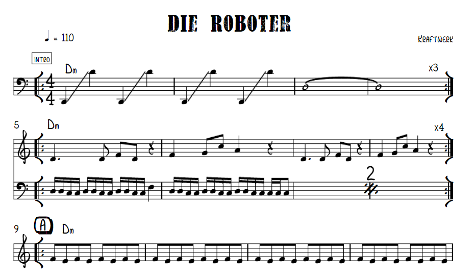
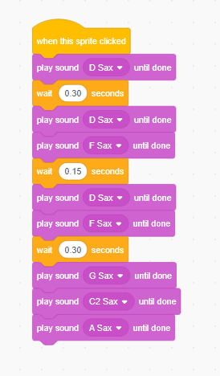

# OCTUBRE

El mes de octubre sirve para presentar la asignatura, para conocer los objetivos
del curso, las herramientas que se van a usar y la organización general de las
clases.


# PRIMERA CLASE (TSME)

0:00 - 0:30

La primera clase debe ser necesariamente una clase de presentación de la
asigunatura los objetivos generales del curso y la organización de las materias.

Para apoyarse en ejemplos, el profesor/a presentará una pieza musical de música electrónica que le interese por algo
y pedirá al alumnado que proponga su propia música electrónica. Se proponen las siguientes audiciones:

En el tiempo de escribir estas lineas, prácticamente todo el alumnado ha escuchado a Daft Punk, sobretodo Get Lucky.
Como Get Lucky es más bien instrumental y voz, se propone escuchar alguna canción del disco 'Homework'. 

Sirva esta pieza como ejemplo de música realizada en los 90s/80s.
- https://www.youtube.com/playlist?list=PLSdoVPM5Wnne3Q2AxosemsThywhraJ0su
    (Homework - Daft Punk)
    
También se propone a Kraftwerk como modelo de una etapa ligeramente anterior, los 80s/70s. 
- https://www.youtube.com/watch?v=5DBc5NpyEoo
    (Der Roboter 1978 - Kraftwerk)

Y Luego algo de música de una época anterior, Delia Derbyshire, de los años 70s/60s.
- https://www.youtube.com/watch?v=XVsqxNy8kkg
    (Electrosonic - Delia Derbyshire)

El objetivo es discutir sobre esta música:
- Podría representarse esta música con partitura tradicional de notas y pentagramas?
- Cuántos sonidos se pueden escuchar en esta obra? a qué instrumentos nos recuerdan?
- Qué pensais que querían los artistas al crear este música? qué relación tiene el titulo
con la música que suena?

A continuación les hablamos del primer instrumento de música electrónica que se conoce, el Theremin. Se habla de que
la historia de la electrónica tiene más de 100 años y de que el primer instrumento que se conoce lo creó Leon Theremin
y que la mejor intérprete de Theremin y la primera fue, Clara Rockmore. Ponemos el video de the Swan con ella tocando
con su heramana al piano. 

Optativamente, podemos montar el Theremin y enseñarles a tocarlo. 

0:30 - 0:60

La última parte de la primera clase la dedicamos a explorar el ordenador, podemos ver:
- Usuario que tenemos y la contraseña.
- Donde poder acceder al volumen general del ordenador, como conectar los auriculares y la interfaz de sonido.
- Cómo conectarse a un altavoz. La diferencia entre altavoces activos y pasivos.
- Hacer soundcheck poniendo un audio de youtube.

0:60 - 1:30

La tercera parte de la clase la hemos dedicado a programar. Hemos elegido la partitura de Roboter de Kraftwerk y la hemos buscado en internet. Hemos aprendido las notas en inglés. DO (C) - RE (D) - MI (E) - FA (F) - SOL (G) - LA (A) - SI (B).



La Melodía principal de la canción es: D - D - F - D  |  F - G - C - A

# SEGUNDA CLASE (PI)

Retomamos la clase anterior repasando los conceptos explicados relativos al ordenador y los pasos que hay que dar para
poder hacer sonido con él: 

- Usuario que tenemos y la contraseña.
- Donde poder acceder al volumen general del ordenador, como conectar los auriculares y la interfaz de sonido.
- Cómo conectarse a un altavoz. La diferencia entre altavoces activos y pasivos.
- Hacer soundcheck poniendo un audio de youtube.

Una vez que queda claro y que todo el mundo ha hecho su soundcheck, repasamos la melodía de Kraftwerk donde lo dejamos la clase
anterior. Cambiamos al gato por un saxofón u otro instrumento musical tradicional en el programa y nos lanzamos a programar de oido
la melodia, sabiendo ya las notas de antemano, que eran: D - D - F - D  |  F - G - C - A. Se insiste en que este trabajo lo hagan solos, para practicar el dictado. Cantan las notas y las intentan programar. 

El resultado que nos tiene que dar es este: 



Y si queremos hacerlo en Sonic Pi, el resultado es este: 

``` python
loop do
  sample :bd_haus
  play :d
  sleep 0.75
  play :d
  sleep 0.25
  sample :bd_haus
  play :f
  sleep 0.25
  play :d
  sleep 0.75
  sample :bd_haus
  play :f
  sleep 0.5
  play :g
  sleep 0.25
  play :c5
  sleep 0.25
  sample :bd_haus
  play :a
  sleep 1
end
```

# TERCERA CLASE (ES)

# CUARTA CLASE (CA)
