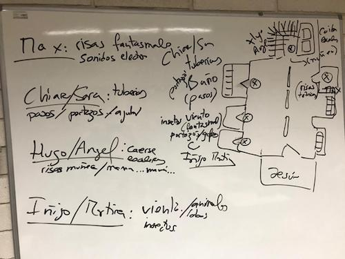

# [INDICE](../indice.md)

# OCTUBRE (Proyecto Halloween)

El mes de octubre sirve para presentar la asignatura, para conocer los objetivos
del curso, las herramientas que se van a usar y la organización general de las
clases.

# PRIMERA SEMANA

0:00 - 0:30

La primera clase debe ser necesariamente una clase de presentación de la
asigunatura los objetivos generales del curso y la organización de las materias.

Para apoyarse en ejemplos, el profesor/a presentará una pieza musical de música electrónica que le interese por algo
y pedirá al alumnado que proponga su propia música electrónica. Se proponen las siguientes audiciones:

En el tiempo de escribir estas lineas, prácticamente todo el alumnado ha escuchado a Daft Punk, sobretodo Get Lucky.
Como Get Lucky es más bien instrumental y voz, se propone escuchar alguna canción del disco 'Homework'.

Sirva esta pieza como ejemplo de música realizada en los 90s/80s.
- https://www.youtube.com/playlist?list=PLSdoVPM5Wnne3Q2AxosemsThywhraJ0su
    (Homework - Daft Punk)

También se propone a Kraftwerk como modelo de una etapa ligeramente anterior, los 80s/70s.
- https://www.youtube.com/watch?v=5DBc5NpyEoo
    (Der Roboter 1978 - Kraftwerk)

Y Luego algo de música de una época anterior, Delia Derbyshire, de los años 70s/60s.
- https://www.youtube.com/watch?v=XVsqxNy8kkg
    (Electrosonic - Delia Derbyshire)

El objetivo es discutir sobre esta música:
- Podría representarse esta música con partitura tradicional de notas y pentagramas?
- Cuántos sonidos se pueden escuchar en esta obra? a qué instrumentos nos recuerdan?
- Qué pensais que querían los artistas al crear este música? qué relación tiene el titulo
con la música que suena?

A continuación les hablamos del primer instrumento de música electrónica que se conoce, el Theremin. Se habla de que
la historia de la electrónica tiene más de 100 años y de que el primer instrumento que se conoce lo creó Leon Theremin
y que la mejor intérprete de Theremin y la primera fue, Clara Rockmore. Ponemos el video de the Swan con ella tocando
con su heramana al piano.

Optativamente, podemos montar el Theremin y enseñarles a tocarlo brevemente.

La última parte de la primera clase la dedicamos a explorar el ordenador, podemos ver:
- Usuario que tenemos y la contraseña.
- Donde poder acceder al volumen general del ordenador, como conectar los auriculares y la interfaz de sonido.
- Cómo conectarse a un altavoz. La diferencia entre altavoces activos y pasivos.
- Hacer soundcheck poniendo un audio de youtube.

Como estamos a las puertas de Haloween, esta clase se puede orientar a trabajar en los sonidos tipicos de Haloween, por ejemplo los que aparecen en la canción "Esto es Halloween" de Pesadilla antes de Navidad.

# SEGUNDA SEMANA

Esta segunda semana tenemos una actividad muy especial, que consiste en dibujar un mapa de los sonidos de la escuela. 
Esta actividad tiene como objetivo principal que el alumnado nuevo de Sonotrónica conozca la escuela y se familiarice con sus sonidos, aulas, espacios, etc.

Para ello se han colocado 5 altavoces bluetooth con 5 sonidos que no corresponden con la escuela. Estos sonidos se han grabado de diferentes espacios sonoros del campo y la ciudad y son: insectos, agua corriendo, gente hablando, galopar de caballos y pájaros trinando.

Para la actividad el alumnado necesita papel y bolígrafo para escribir todo lo que oye, así como para diferenciar entre sonidos reales y sonidos "artificales". 

Retomamos la clase anterior repasando los conceptos explicados relativos al ordenador y los pasos que hay que dar para
poder hacer sonido con él:

- Usuario que tenemos y la contraseña.
- Donde poder acceder al volumen general del ordenador, como conectar los auriculares y la interfaz de sonido.
- Cómo conectarse a un altavoz. La diferencia entre altavoces activos y pasivos.
- Hacer soundcheck poniendo un audio de youtube.

Por último se hace un diseño sonoro del espacio para trabajar al siguiente día: 

# TERCERA SEMANA

Esta semana se comienza la clase directmente o bien grabando o bien descargando de Freesound.org los sonidos que necesitamos para crear este pasaje del terror. 

Posteriormente se trabaja conjuntamente sobre Audacity, por ejemplo a través de [este tutorial](https://www.youtube.com/watch?v=ge6s3ZSO26U)

Los audios ya mezclados por los alumnos darían este resultado: 

<audio controls="controls">
  <source type="audio/wav" src="audios/octubre/chiara-sara-proyecto.wav"></source>
  
Your browser does not support the audio element.

</audio>

<audio controls="controls">
  <source type="audio/wav" src="audios/octubre/hugo-angel-proyecto.wav"></source>
  
Your browser does not support the audio element.

</audio>

<audio controls="controls">
  <source type="audio/wav" src="audios/octubre/inigo-martina-proyecto.wav"></source>
  
Your browser does not support the audio element.

</audio>

<audio controls="controls">
  <source type="audio/wav" src="audios/octubre/max-proyecto.wav"></source>
  
Your browser does not support the audio element.

</audio>

<audio controls="controls">
  <source type="audio/wav" src="audios/octubre/pedro-proyecto.wav"></source>
  
Your browser does not support the audio element.

</audio>

# CUARTA SEMANA

Esta última clase se trata de iluminar y colocar los sonidos estratégicamente para que las familias pasen a pasar mucho miedo por el día de Haloween.

<video controls="controls">
  <source type="video/mp4" src="audios/octubre/instalacion.mp4"></source>
  
Your browser does not support the video element.

</video>
