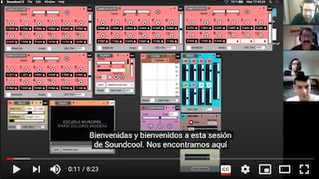

## [~ Índice ~](../README.md)

# SONOTRONICA

El índice de este documento está relacionado con las clases de SONOTRÓNICA,
sirva este documento como diario de la experiencia impartiendo esta asignatura.

# PRIMER CURSO

## Primer Trimestre

| [OCTUBRE](octubre.md)                                       | [NOVIEMBRE/DICIEMBRE](noviembre.md)           |
|                    :---------------------:                  |        :------------------------:             | 
|  | |
| Halloween                                                   | Navidades Holográficas                        |

## Segundo Trimestre 

|[ENERO](enero.md)                       |[FEBRERO](febrero.md)              |[MARZO](marzo.md)                      |
|        :---------------------:         |       :---------------------:     |         :---------------------:       |
|                                        ||                             |
|  01010101                              |Die Roboter                        |   Los sonidos de casa                 |

## Tercer Trimestre

### [ABRIL](abril.md) - Un cuento sonoro

### [MAYO](mayo.md) - Historia de los Beats

### [JUNIO](junio.md) - Remix

# SEGUNDO CURSO

## Primer Trimestre

## Segundo Trimestre

## Tercer Trimestre