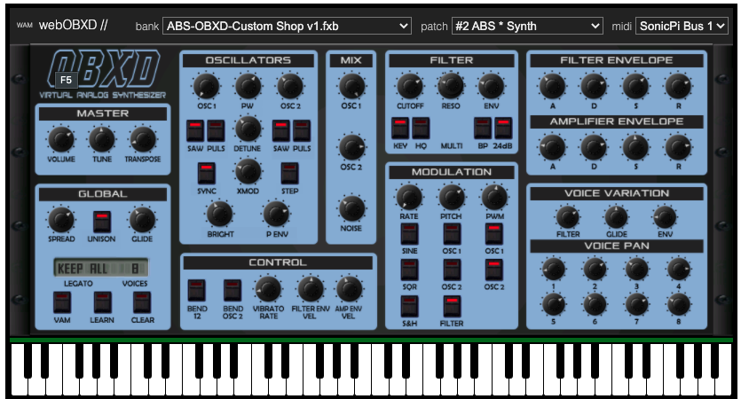

## [~ Índice ~](Indice.md)

# ENERO

Este trimestre vamos a trabajar objetivos relacionados con el aprendizaje de sonidos electrónicos y/o modificación de grabaciones de audio. 

Lo vamos a hacer desde la perspectiva interpretativa, es decir, que se aprenden sonidos para tocarlos. 

Para ello vamos a trabajar en paralelo, un recurso web que sirve para aprender síntesis electrónica de Ableton. Aquí hay [un enlace](https://learningsynths.ableton.com/es) al proyecto.

Cada semana se va a trabajar un apartado de este tutorial, buscando reforzar este aprendizaje con la creación e interpretación de piezas sencillas tocando el teclado midi.

En principio nos vamos a basar en un [sintetizador online](https://www.webaudiomodules.org/wamsynths/obxd).



Este sintetizador provee de conexión directa con el teclado midi que tenemos en las aulas y de una librería de sintetizadores lo suficientemente amplia para abarcar gran cantidad de piezas.

# PRIMERA SEMANA

Para este primera semana nos vamos a centrar en el apartado "Realizar cambios" del tutorial de Ableton. En este apartado se cubren los elementos más básicos de la creación sonora electrónica: 
- Amplitud de un sonido (volumen)
- Tono de un sonido (altura)

Para trabajar estos dos conceptos, proponemos la escucha de la siguiente pieza: 

[James Bernard - Unknown Works A04](https://www.youtube.com/watch?v=RpD5EsPRTbs)
Fragmento (0:00 a 3:00)

Tenemos que reconocer, en este fragmento de pieza, sobretodo dos elementos. Dos timbres diferentes, uno grave y otro agudo, uno sencillo y otro complejo. 

La pieza comienza con varias notas (Sib, Mib, Ab, Solb) sobretodo, y el agudo con diferentes notas no fácilmente centradas en una fundamental. 

Para su interpretación se proponen los siguientes dos presets del sintetizador online propuesto:

Voz 1 - Sonidos graves, textura sencilla.


Voz 2 - Sonidos agudos, textura compleja.


ESTE APARTADO TAMBIÉN TIENE COMO OBJETIVO TRABAJAR NOTAS LARGAS

# SEGUNDA SEMANA

En este segundo apartado vamos a comprobar el potencial musical de "patch tweak", es decir secuenciar una serie de sonidos y cambiar los valores del sintetizador para producir cambios a lo largo del tiempo.

Este concepto, dentro del tutorial de síntesis de ableton que estamos usando, viene explicado en el apartado "Conceptos básicos de un sintetizador", que trabaja: 
- amplitud
- brillo (filtro)
- movimiento (modulación)

Para ilustrar este tipo de música realizamos la escucha de este tema de Suzanne Ciani:

[Suzanne Ciani - Bucha Eagel Concerts 1975]
(https://www.youtube.com/watch?v=qCfRqIqnSNY)

Para realizar el ejercicio, necesitamos tener el software Sonic Pi instalado, y la siguiente configuración del sintetizador OBXD que proponemos anteriormente:


Como se puede comprobar, en este apartado, no vamos a utilizar el teclado midi que tenemos en el aula, sino que vamos a enviar mensajes midi desde Sonic Pi. 

El código necesario para enviar mensajes midi y que los reciba correctamente el sintetizador es el siguiente: 

``` python
live_loop :secuenciador do
  note = scale(:eb2, :dorian).choose
  midi_note_on note, 50
  sleep 0.1
  midi_note_off note, 50
  sleep 0.1
end
```

Si se para el secuenciador sin enviar el correspondiente mensaje de note_off, es necesario ejecutar este código para silenciar todas las notas: 

``` python
128.times do |note|
  midi_note_off note, 50
end
```

El ejercicio, pues consiste en grabar una pista de dos minutos con una secuencia ininterrumpida de notas, cambiando los parámetros necesarios para modificar el sonidos. 

Se recomienda probar: 
- Master ->  volumen, transpose.
- Osciladores -> Saw, Puls, XMod.
- Filter -> Cutoff, Reso.
- Amplifier Envelope -> A, D, S, R.


# TERCERA SEMANA


# CUARTA SEMANA

STRANGER THINGS
https://soundation.com/station/2019/07/22/recreating-the-stranger-things-theme/