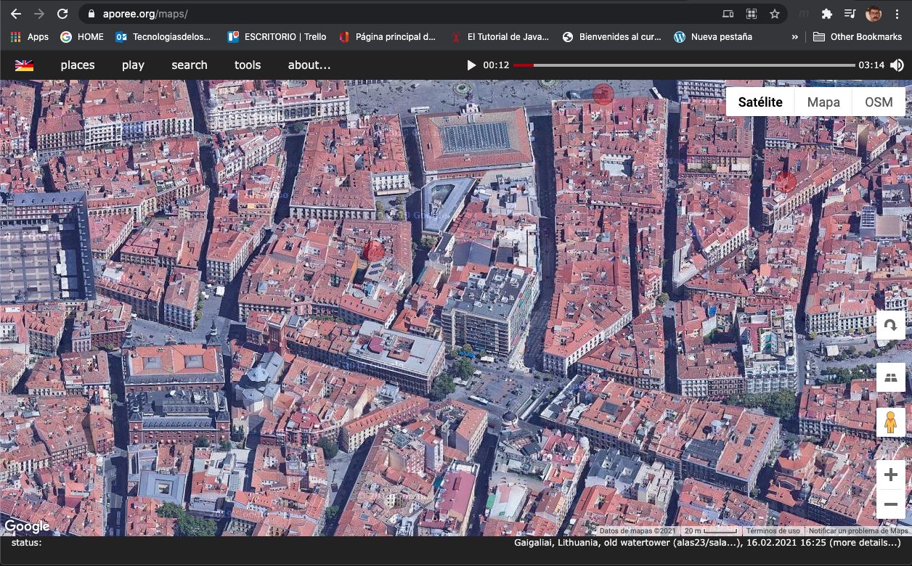
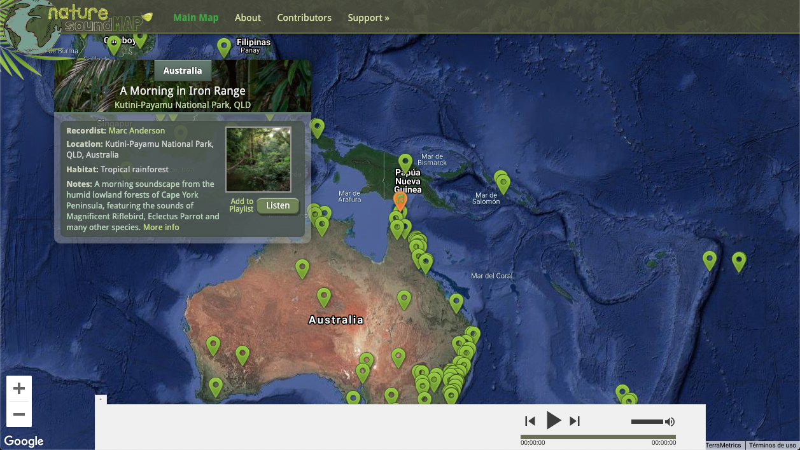
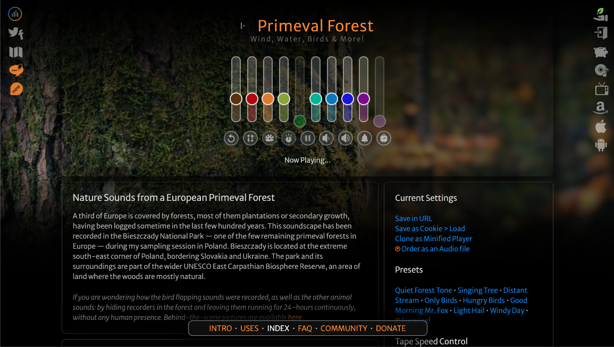

## [~ Índice ~](Indice.md)

# MARZO

# PRIMERA SEMANA

Esta primera semana vamos hacer una actividad de escucha. El objetivo es aprender a usar grabaciones de campo como herramienta de creación sonora.

Se trata, pues, de hacer un ejercicio de **limpieza de oidos**

Lo primero que vamos a hacer es entrar en estas páginas web para escuchar diferentes sonidos de paisajes sonoros del mundo. Hay de dos tipos: uno de sonidos urbanos y rurales y el otro exclusivo de sonidos de la naturaleza.

El ejercicio consiste, simplemente en escuchar lo que se oye.

Después nos salimos a la calle y sacamos una grabadora. Se trata de sentarse un rato en el patio y grabar 10 minutos mientras el alumnado apunta lo que se ha escuchado, luego se comparan la grabación y los apuntes del alumnado. 
Para que el alumnado pueda escribir lo que escucha se puede sacar una hoja de papel y lápiz o bolígrafo.

El siguiente ejercicio, consiste en entrar en la web de MyNoise y ver cómo de sencillo es alterar los sonidos del ambiente controlando qué quieres que suene más y qué quieres que suene menos, creando un discurso sonoro que evolucione en el tiempo. 

[]](https://mynoise.net/)

Por último, vamos a trabajar los sonidos modificandolos un poco con un programa de edición, esto lo vamos a hacer con lmms o audácity.

El efecto que vamos a trabajar es el ecualizador.

# SEGUNDA SEMANA

# TERCERA SEMANA

# CUARTA SEMANA
