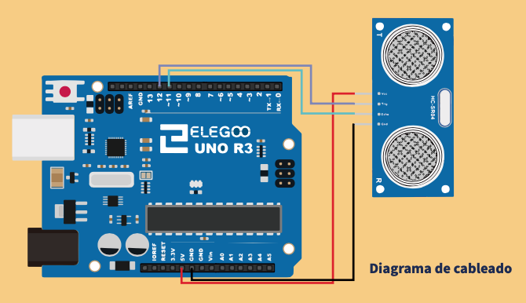
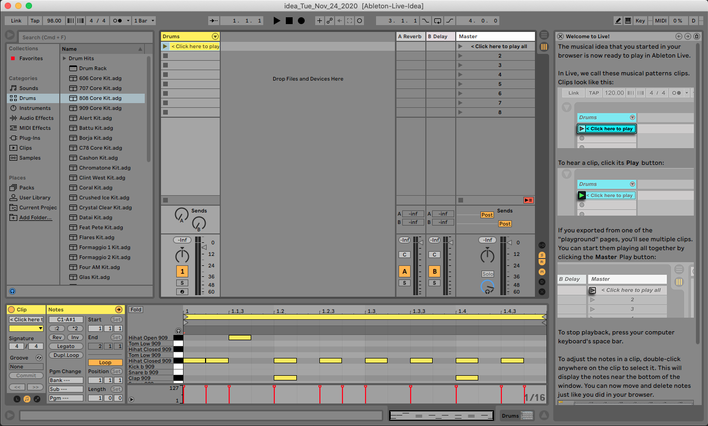

# [Primer trimestre](primer-trimestre.md)

Para el segundo/tercer curso, para cuando el alumnado ya es adolescente o preadolescente, las herramientas propuestas serán estas, aunque no todo el alumnado debe seguir este esquema, sino elegir lo que más les guste.

|**Sonic Pi**                            | **Arduino**                       |**Ableton Live**                       |
|        :---------------------:         |       :---------------------:     |         :---------------------:       |
| ||       |

