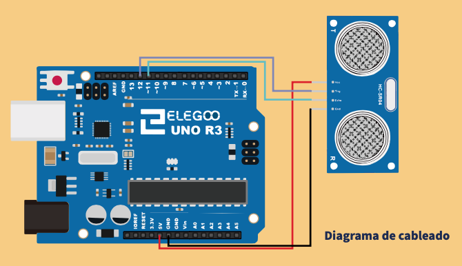
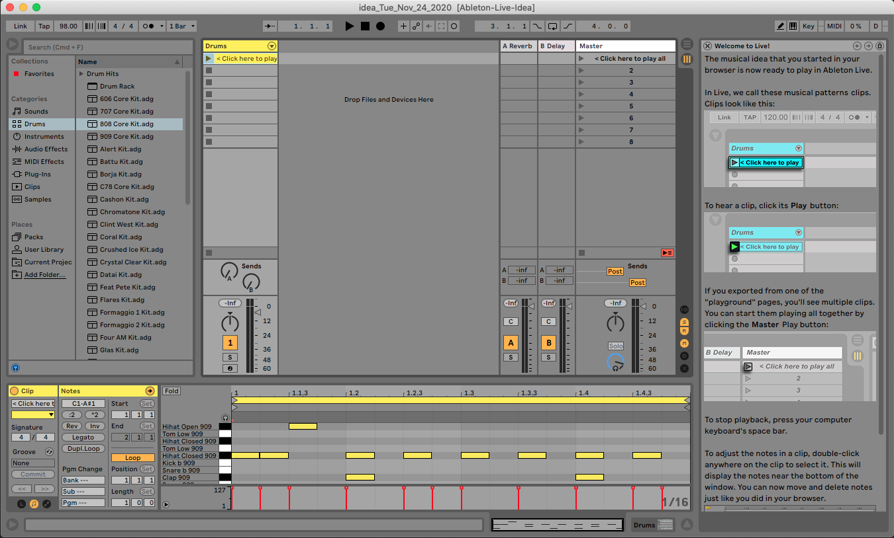

# Primer trimestre

Para el segundo/tercer curso, para cuando el alumnado ya es adolescente o preadolescente, las herramientas propuestas serán estas, aunque no todo el alumnado debe seguir este esquema, sino elegir lo que más les guste.

- Teoría sobre sonido y música electrónica con sonic pi
- Programación informática con Arduino
- Creación musical con Ableton Live

## Sonic Pi

Sonic pi en este nivel se va a ver de una forma más avanzada. Vamos a comenzar este curso avanzado aprendiendo a crear funciones que realicen las tareas que necesitamos.

La primera es crear una función que toque unos acordes en función de los parámetros de entrada: 

``` python
define :acorde do |nota = :c4, modo = "mayor"|
  play nota
  sleep 0.5
  play nota+4 if (modo == "mayor")
  play nota+3 if (modo == "menor")
  sleep 0.5
  play nota+7
  sleep 1
end


acorde(:c5, "menor")
acorde(:g4, "menor")
acorde(:f4, "menor")
acorde(:c4, "menor")
```

Para llegar a este resultado, tienen que leer el apartado de funciones y crear funciones tipo más sencillas como la función suma, la función multiplicación. 

Una vez que resuelvan cómo hacer una función que toque acordes, deben crear una pequeña composición con esta nueva función que han creado.

## Arduino

En este ejercicio se trata de aprender a hacer un Theremin electrónico, pero no con sonido continuado todavía, sino con saltos cada 100 milisegundos. Esta sería la conexión para poner el sensor. El altavoz va a estar en el pin 9.



La fórmula para relacionar el sensor de distancia con el tono de la melodía, con la frecuencia, es la siguiente:
1500-(a*10) siendo a el valor que devuelve el sensor.

La razón de esto es para escalar la frecuencia entre (1500 - 0*10 = 1500Hz) y (1500 - 90*10 = 600Hz)
Obviamente estos valores pueden cambiarse.

Lo ideal es dejar que el alumno/a trate de llegar a una solución individual.


``` c++

#include "SR04.h"
#define TRIG_PIN 12
#define ECHO_PIN 11
SR04 sr04 = SR04(ECHO_PIN,TRIG_PIN);
long a;

void setup() {
   Serial.begin(9600);
   delay(1000);
}

void loop() {
   a=sr04.Distance();
   Serial.print(a);
   Serial.println("cm");
   tone(9, 1500-(a*10), 100);
   delay(100);
}

```

## Ableton Live

En este primer ejercicio vamos a continuar con la idea de crear beats en Ableton Live. 

Para ello:
- Nos aseguramos de que estamos en el tempo y beats adecuados.
- Creamos un track MIDI.
- Cargamos un Drum Rack, para que se precarguen todos los sonidos.
- Creamos un clip vacío. 
- Seleccionamos los sonidos al ritmo que queremos.
- Asociamos este clip a un botón de nuestra interfaz midi.


